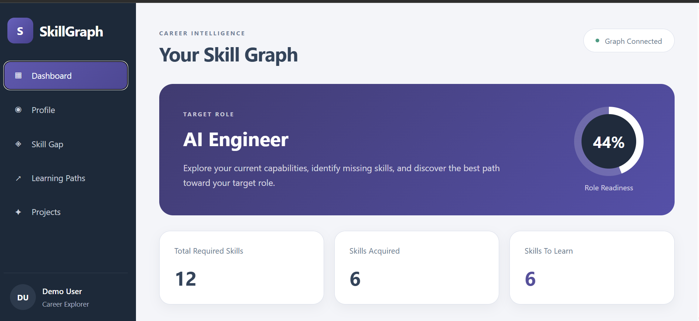
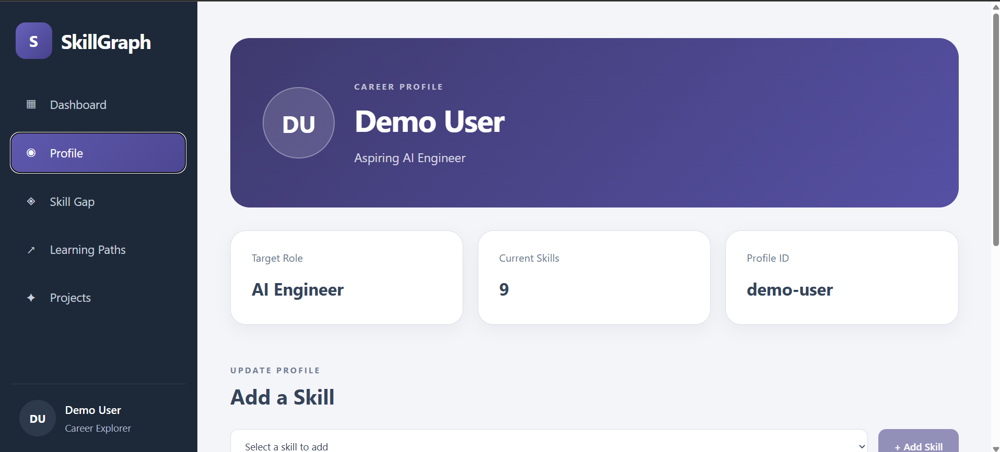
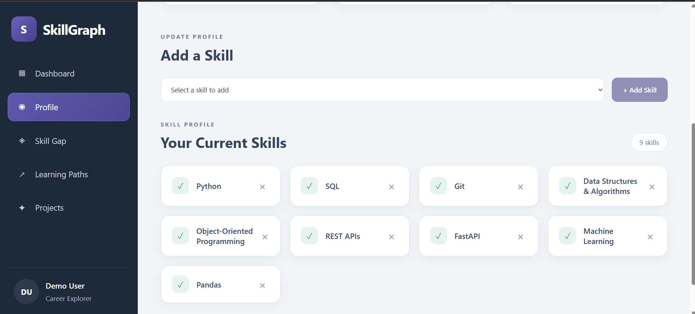
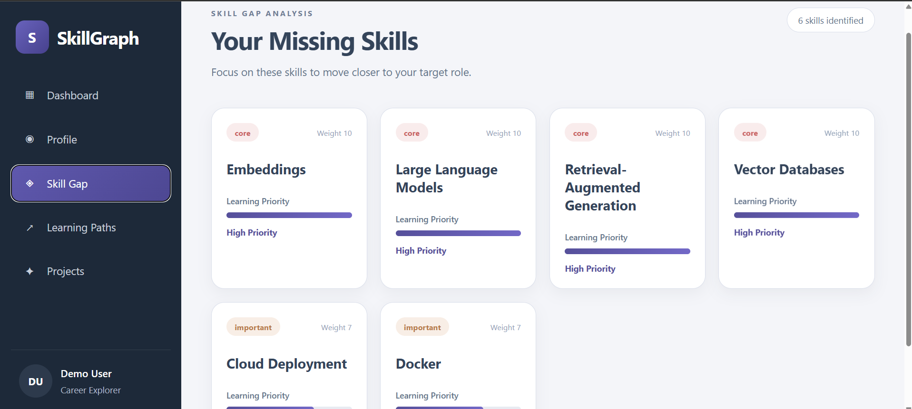
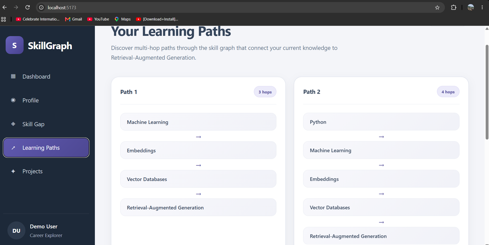
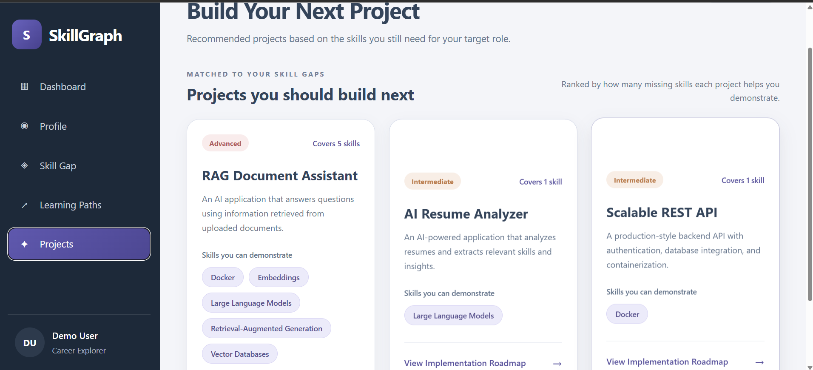
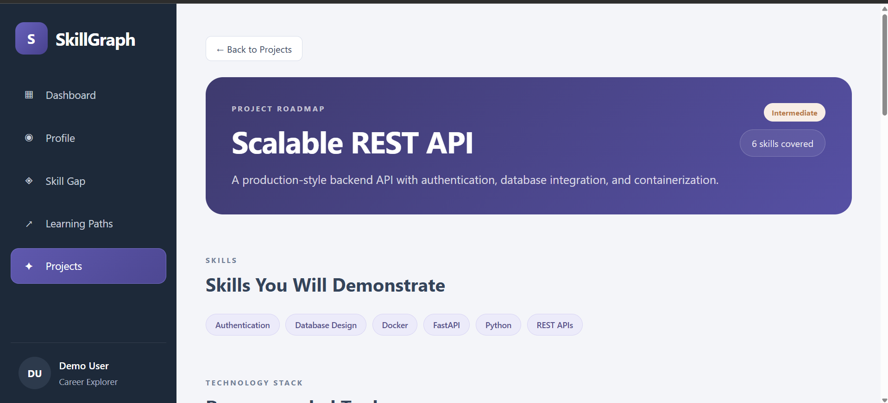
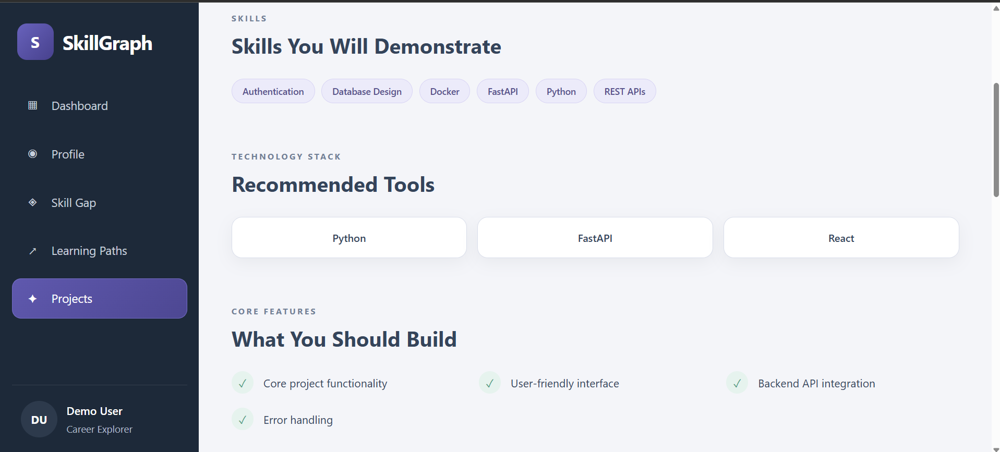

# SkillGraph AI

A graph-powered skill intelligence and career planning platform that helps users analyze their current skills, identify skill gaps for a target role, explore learning paths, and discover relevant projects.

SkillGraph AI uses a graph database to model relationships between users, skills, job roles, prerequisites, and projects, allowing the application to generate structured career insights.
## 🚀 Live Demo

[Visit SkillGraph AI](https://skill-graph-ai-self.vercel.app/)
---

## 🚀 Features

### 📊 Career Dashboard

- Displays the user's target role
- Calculates a weighted role readiness score
- Shows total required skills
- Shows acquired skills
- Identifies skills remaining to learn
- Provides a visual overview of skill progress

### 👤 Profile

- Displays the user's profile information
- Shows the target role
- Displays the user's current skills
- Retrieves profile information dynamically from the backend

### 🎯 Skill Gap Analysis

- Compares the user's current skills with the skills required for a target role
- Identifies missing skills
- Prioritizes skills based on importance
- Uses weighted skill relationships for readiness analysis

### 🛣️ Learning Paths

- Uses graph relationships to explore prerequisite paths
- Identifies logical learning sequences
- Helps users understand how their current skills connect to target skills

### 💡 Project Recommendations

- Recommends projects relevant to skills and career goals
- Provides detailed project information
- Helps users identify practical projects to strengthen their profile

---

# 🏗️ Architecture

```text
Frontend (React + Vite)
        │
        │ HTTP / REST API
        ▼
Backend (FastAPI)
        │
        │ Neo4j Python Driver
        ▼
CognoDB Graph Database
```

The application uses a graph-based approach to model relationships between:

- Users
- Skills
- Job Roles
- Learning Prerequisites
- Projects

Example relationship structure:

```text
(User)
   │
   ├── HAS_SKILL ────────> (Skill)
   │
   └── TARGETS ──────────> (JobRole)
                                │
                                └── REQUIRES ───> (Skill)

(Skill)
   │
   └── PREREQUISITE_OF ──> (Skill)

(Project)
   │
   └── RELATED_TO ───────> (Skill)
```

---

# 🛠️ Tech Stack

## Frontend

- React
- Vite
- Axios
- CSS

## Backend

- Python
- FastAPI
- Uvicorn
- Pydantic
- Pydantic Settings
- Python Dotenv

## Database

- CognoDB
- Neo4j Python Driver
- Graph Database Concepts
- Cypher Queries

---

# 📂 Project Structure

```text
SkillGraphAI/
│
├── backend/
│   │
│   ├── app/
│   │   │
│   │   ├── core/
│   │   │   ├── config.py
│   │   │   └── database.py
│   │   │
│   │   ├── queries/
│   │   │   ├── dashboard.py
│   │   │   └── roles.py
│   │   │
│   │   ├── routers/
│   │   │   ├── dashboard.py
│   │   │   ├── learning_paths.py
│   │   │   ├── profile.py
│   │   │   ├── projects.py
│   │   │   ├── roles.py
│   │   │   └── skills.py
│   │   │
│   │   ├── schemas/
│   │   │   ├── dashboard.py
│   │   │   ├── learning_path.py
│   │   │   ├── profile.py
│   │   │   ├── project.py
│   │   │   ├── role.py
│   │   │   └── skill.py
│   │   │
│   │   ├── services/
│   │   │   ├── dashboard.py
│   │   │   ├── profile.py
│   │   │   └── roles.py
│   │   │
│   │   └── main.py
│   │
│   └── scripts/
│       ├── seed_database.py
│       ├── test_connection.py
│       ├── test_graph_queries.py
│       └── verify_database.py
│
├── frontend/
│   │
│   ├── public/
│   │
│   ├── src/
│   │   │
│   │   ├── components/
│   │   │   ├── LearningPaths.jsx
│   │   │   ├── Profile.jsx
│   │   │   ├── ProjectDetails.jsx
│   │   │   ├── Projects.jsx
│   │   │   └── SkillGap.jsx
│   │   │
│   │   ├── App.css
│   │   ├── App.jsx
│   │   ├── index.css
│   │   └── main.jsx
│   │
│   ├── package.json
│   └── vite.config.js
│
├── .env.example
├── .gitignore
├── README.md
└── requirements.txt
```

---

# ⚙️ Local Setup

## 1. Clone the Repository

```bash
git clone https://github.com/YOUR_USERNAME/SkillGraph-AI.git
```

Navigate to the project directory:

```bash
cd SkillGraph-AI
```

---

# 🐍 Backend Setup

## 2. Create a Virtual Environment

```bash
python -m venv .venv
```

### Windows

```bash
.venv\Scripts\activate
```

---

## 3. Install Backend Dependencies

```bash
pip install -r requirements.txt
```

---

## 4. Configure Environment Variables

Create a `.env` file in the project root.

```env
COGNODB_URI=bolt+s://your-instance-id.databases.cognodb.cloud
COGNODB_USERNAME=cognodb
COGNODB_PASSWORD=your-password-here
```

You can use `.env.example` as a reference.

> **Important:** Never commit your actual `.env` file containing database credentials.

---

## 5. Start the Backend

Run the following command from the project root:

```bash
uvicorn backend.app.main:app --reload
```

The FastAPI backend will run at:

```text
http://127.0.0.1:8000
```

You can also access the FastAPI interactive API documentation at:

```text
http://127.0.0.1:8000/docs
```

---

# ⚛️ Frontend Setup

Open a new terminal and navigate to the frontend directory:

```bash
cd frontend
```

Install the frontend dependencies:

```bash
npm install
```

Start the development server:

```bash
npm run dev
```

The frontend will typically run at:

```text
http://localhost:5173
```

---

# 🔌 API Endpoints

| Method | Endpoint | Description |
|--------|----------|-------------|
| GET | `/` | API welcome endpoint |
| GET | `/health` | Health check |
| GET | `/api/dashboard/` | Dashboard summary and readiness score |
| GET | `/api/profile/` | User profile and current skills |
| GET | `/api/skills/` | Get all available skills |
| GET | `/api/skills/user` | Get the user's current skills |
| POST | `/api/skills/user` | Add a skill to the user's profile |
| DELETE | `/api/skills/user/{skill_id}` | Remove a skill from the user's profile |
| GET | `/api/skills/gap` | Skill gap analysis |
| GET | `/api/skills/learning-path` | Learning path recommendations |
| GET | `/api/projects/` | Recommended projects |

---

# 🧠 Skill Readiness Calculation

Role readiness is calculated using weighted skill importance.

```text
Readiness Score =
(Acquired Skill Weight / Total Required Skill Weight) × 100
```

This approach ensures that more important skills have a greater impact on the user's overall readiness score.

For example, if a user has acquired skills with a combined weight of `70` out of a total required weight of `100`:

```text
Readiness Score = (70 / 100) × 100

Readiness Score = 70%
```

This provides a more meaningful readiness score than simply counting the number of acquired skills.

---

# 🕸️ Graph-Based Skill Intelligence

The application uses a graph database because career and skill relationships are naturally interconnected.

For example:

```text
Python
   │
   ├── PREREQUISITE_OF
   ▼
Machine Learning
   │
   ├── PREREQUISITE_OF
   ▼
Deep Learning
   │
   ├── PREREQUISITE_OF
   ▼
Generative AI
```

These relationships can be queried to identify:

- Missing skills
- Prerequisite chains
- Learning paths
- Skills required for specific job roles
- Projects related to a user's career goals

---

# 🔮 Future Improvements

Potential future enhancements include:

- User authentication
- Multiple user profiles
- Dynamic target role selection
- Resume parsing
- Automatic skill extraction from resumes
- Personalized AI-powered learning recommendations
- LLM-based career guidance
- More advanced graph visualization
- Docker containerization
- CI/CD pipeline
- Cloud deployment
- Improved project recommendation logic
- Personalized career roadmaps

---

## 📸 Screenshots

### 🏠 Dashboard



---

### 👤 Profile





---

### 📊 Skill Gap Analysis



---

### 🛤️ Learning Paths



---

### 💡 Project Recommendations







---

# 🎯 Project Goals

SkillGraph AI was built to explore the practical combination of:

- Full-stack development
- Graph databases
- FastAPI
- React
- REST APIs
- Cypher queries
- Data modeling
- Career intelligence systems

The project demonstrates how graph-based relationships can be used to move beyond simple lists of skills and instead model meaningful connections between users, career goals, required skills, prerequisites, and projects.

---

# 👨‍💻 Author

**M Sakthi Sorna Maheswar**

Built as a full-stack project to explore graph databases, skill intelligence, FastAPI, React, and career planning systems.
